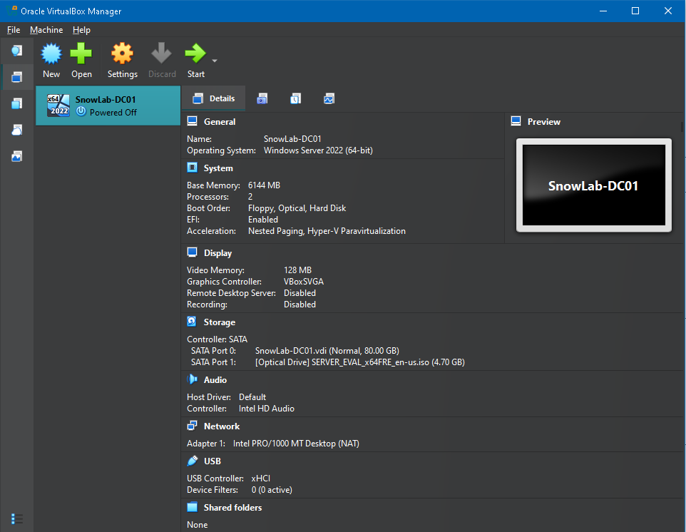
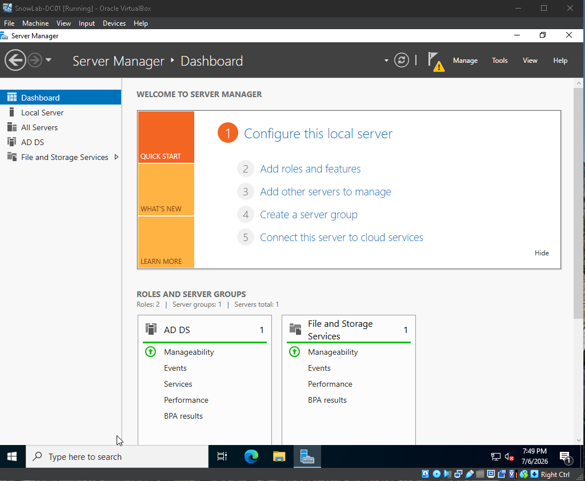
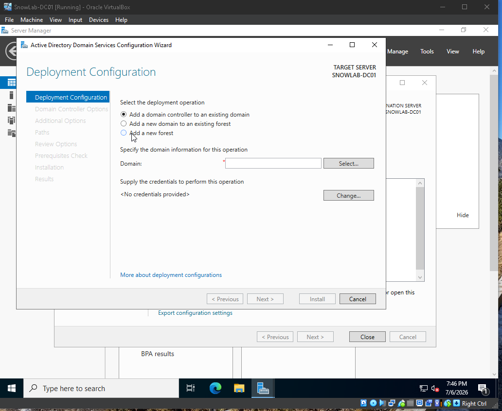
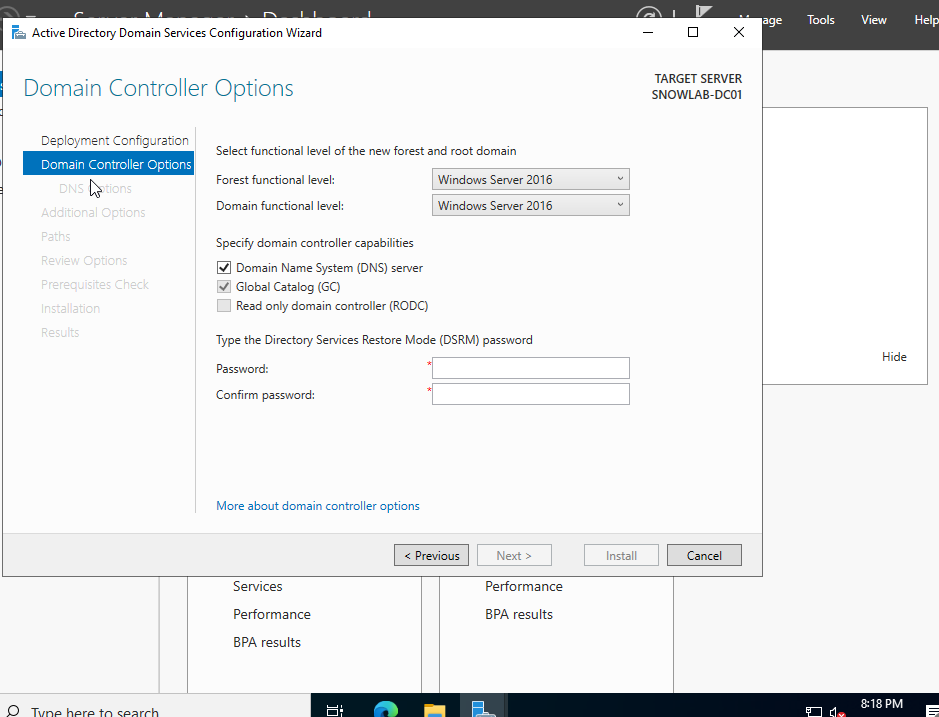
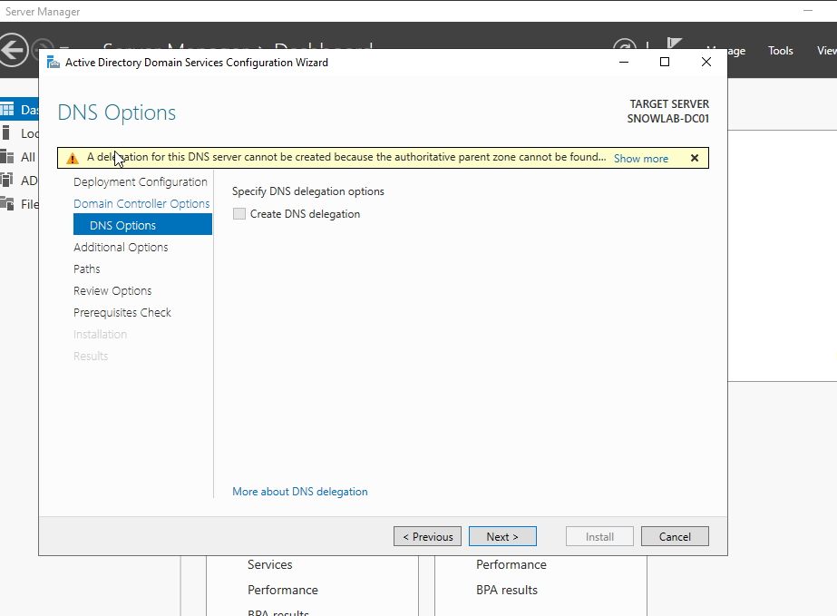
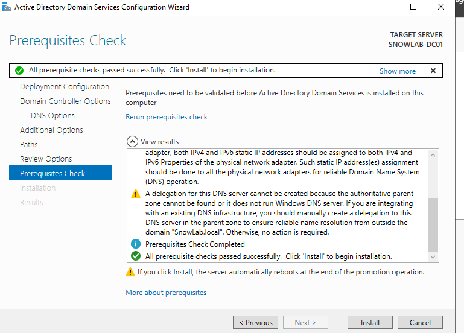
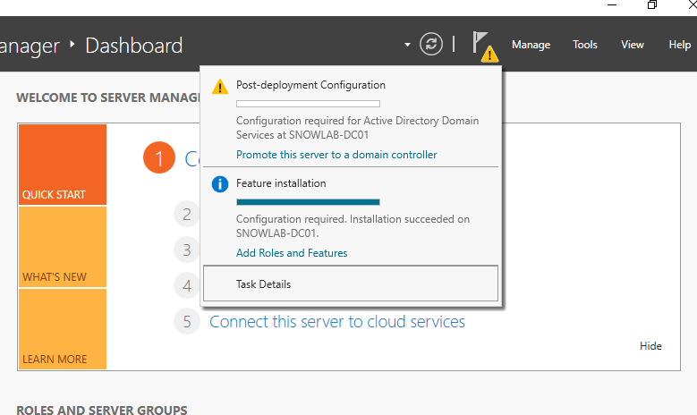
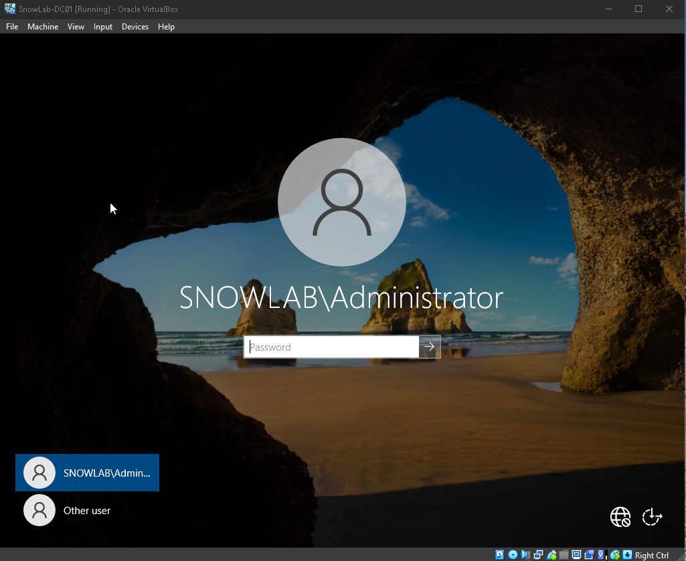

# Domain Controller Creation

#SnowLab.DC1 

> "The computer doesn't care what you know. It responds to what you build."

# Captain's Log

Stardate: 2026.188

The SnowLab infrastructure project officially entered service following the successful deployment of Active Directory Domain Services on Windows Server 2022.

The initial objective was to create a functioning enterprise domain that could be expanded over time into a realistic IT administration environment.

Current focus has shifted from deployment to administration as the next phase introduces Organizational Units, Group Policy, Windows clients, and PowerShell automation.

                   Internet
                       │
               Oracle VirtualBox
                       │
                ┌─────────────┐
                │ SNOWLAB-DC01│
                │Domain Control│
                └──────┬──────┘
                       │
               snowlab.local
                       │
          Future Enterprise Systems

# ⚓ Mission Preparation

Before commissioning the SnowLab enterprise environment, I first built the virtual infrastructure using Oracle VirtualBox.

The lab was configured with:

- **Hypervisor:** Oracle VirtualBox
- **Virtual Machine:** SNOWLAB-DC01
- **Operating System:** Windows Server 2022 (64-bit)
- **Memory:** 6 GB RAM
- **Processors:** 2 vCPUs
- **Storage:** 80 GB Virtual Disk
- **Network Adapter:** NAT

This virtual machine serves as the foundation of the SnowLab enterprise infrastructure.

          
Current Status

🟢 Domain Controller Online

🟢 Active Directory Operational

🟢 DNS Operational

🟡 Building Enterprise Structure

🔵 Windows Client Deployment (Next Mission)

# Captain's Deployment Logs

---

### 📖 Log 001 — Windows Server 2022 Deployed

Mission Control confirmed the successful deployment of Windows Server 2022 on **SNOWLAB-DC01**.

At this stage, the server was operating as a standalone Windows installation with no infrastructure roles assigned. From this point forward, every service would be intentionally configured to build the SnowLab enterprise environment.

### 🖖 Captain's Reflection

Every enterprise environment starts somewhere. Before Active Directory, DNS, or Group Policy, there has to be a stable operating system. Seeing Server Manager for the first time marked the official beginning of SnowLab and the foundation for every mission that followed.

---

## 📖 Log 002 — Static Network Configuration

Before promoting the server to a Domain Controller, a static IPv4 address was assigned to ensure reliable DNS and Active Directory services.

---

## 📖 Log 003 — Installing Active Directory Domain Services

The Active Directory Domain Services (AD DS) role was successfully installed on **SNOWLAB-DC01**.

At this stage, the server had not yet become a Domain Controller. Windows Server requires a second configuration phase where the server is promoted into a new or existing forest.

This marked the transition from a standalone Windows Server to enterprise infrastructure.

---

### 📖 Log 004 — Establishing the SnowLab Forest

The SnowLab environment officially received its enterprise identity by creating the snowlab.local forest.

The Active Directory configuration wizard was used to create the first enterprise forest, **snowlab.local**.

This established the identity of the SnowLab environment and prepared the server for promotion into the first Domain Controller.

### 🌐 DNS Delegation Advisory

During the forest creation process, Windows displayed a DNS delegation warning.

Because SnowLab was creating a brand-new private Active Directory forest (`snowlab.local`), there was no parent DNS zone from which a delegation could be created.

This warning did not prevent deployment.

### 🖖 Captain's Reflection

This was one of the biggest learning moments during the deployment.

At the start I assumed the warning indicated a failed configuration. After researching the message, I learned that DNS delegation is only required when integrating with an existing DNS hierarchy.

Understanding why the warning appeared helped me better understand the relationship between Active Directory and DNS.

## 📖 Log 005 — Domain Controller Promotion (SNOWLAB-DC01 enters service)

Following prerequisite validation,

SNOWLAB-DC01 entered service as the first Domain Controller.

The server was successfully promoted to the first Domain Controller for the SnowLab forest.

---

## 📖 Log 006 — Successful Authentication

Domain services were verified after promotion.

# Hostname

SNOWLAB-DC01

# Operating System

Windows Server 2022

# Role

Domain Controller

# Forest

snowlab.local

# Primary Services

• Active Directory
• DNS

[✓] Windows Server Installed

[✓] Static Networking

[✓] Active Directory Installed

[✓] Forest Created

[✓] DNS Configured

[ ] Organizational Units

[ ] Windows Client

[ ] Group Policy

Mission 002 — Organize Starfleet Personnel (Organizational Units)

Status: Awaiting Orders

Mission 003 — Bring Additional Crew Aboard (Windows 11 Domain Join)

Status: Awaiting Orders

Mission 004 — Starfleet Directives (Group Policy)

Status: Awaiting Orders

Mission 005 — Automation Protocols (PowerShell)

One thing that surprised me during deployment was how dependent Active Directory is on DNS.

Before this project, I understood that DNS resolved hostnames. Building my own domain showed me that Active Directory relies on DNS for locating domain controllers, authentication, and service discovery.

Understanding why the DNS delegation warning appeared was one of the biggest lessons from this deployment.
