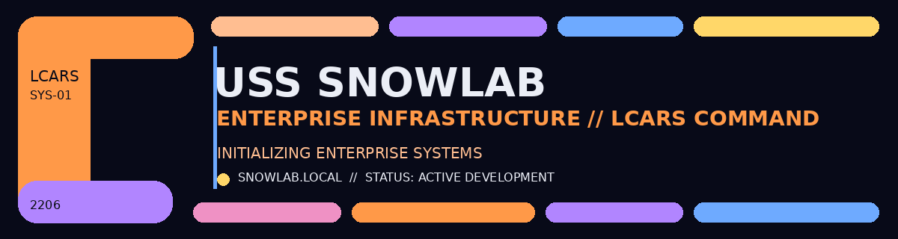

# 🖖 USS SNOWLAB
### Enterprise Infrastructure Home Lab

  

> ## "The unknown isn't something to fear. It's something to explore."

## 🟧  // SYSTEM OVERVIEW

> **USS SNOWLAB // ENTERPRISE INFRASTRUCTURE HOME LAB**

- 🖥️ **Command Node:** `SNOWLAB-DC01`
- 🌐 **Primary Domain:** `snowlab.local`
- 🛰️ **Environment:** Oracle VirtualBox
- 🟢 **Mission Status:** ACTIVE DEVELOPMENT

---

### 🖖 MISSION PROFILE

USS SnowLab is an evolving enterprise IT environment built to turn
individual technologies into one connected, working infrastructure.

The mission is to develop hands-on experience across:

- **Windows Administration** // Server, Clients & Active Directory
- **Network Operations** // TCP/IP, DNS & Segmentation
- **Identity & Access** // Users, Groups & Authentication
- **Security** // Isolation, Access Control & Troubleshooting
- **Automation** // PowerShell & Administrative Tasks
- **Future Systems** // Microsoft 365, Azure & Cloud Technologies

> **This is not one lab. This is where the systems come together.**

`LCARS // SYSTEM STATUS: OPERATIONAL`

**This is the environment where the labs connect.**
---

# 🛰️ Enterprise Architecture

The environment is currently hosted in Oracle VirtualBox and centered around the `snowlab.local` Active Directory domain.

  

# 🟦 // NETWORK TOPOLOGY

                         INTERNET
                            │
                      HOME NETWORK
                            │
                    ORACLE VIRTUALBOX
                            │
                     ┌──────┴──────┐
                     │ USS SNOWLAB │
                     └──────┬──────┘
                            │
                       snowlab.local
                            │
                    ┌───────┴────────┐
                    │                │
              SNOWLAB-DC01      FUTURE SYSTEMS
              Server 2022
               AD DS / DNS

          ⚠ NETWORK REDESIGN IN PROGRESS

---

# 🟨 // SYSTEMS DATABASE

| SYSTEM | DESIGNATION | STATUS |
|---|---|---|
| 🖥️ Windows Server | SNOWLAB-DC01 | 🟢 ONLINE |
| 🪪 Active Directory | snowlab.local | 🟢 OPERATIONAL |
| 🌐 DNS | Windows Server DNS | 🟢 OPERATIONAL |
| 🛡️ Network Perimeter | SnowLab Network | 🟡 RECONFIGURATION |
| 💻 Windows 11 Endpoint | SNOWLAB-CLIENT01 | 🔵 PLANNED |
| 👥 Enterprise Identity | OUs / Users / Groups | 🔵 PLANNED |
| 📜 Group Policy | Centralized Management | 🔵 PLANNED |
| ⚙️ PowerShell | Administration Automation | 🔵 PLANNED |

---

---

# 🟥 // MISSION DATABASE
### SnowLab Project Directory

---

## 🟢 001 // DOMAIN CONTROLLER COMMISSIONING
### *(Windows Server 2022 / Active Directory / DNS)*

`STATUS // COMPLETE`

Deployed **SNOWLAB-DC01** as the first Domain Controller for the
`snowlab.local` forest.

[🖖 Active Directory/Domain Controller →](Active-Directory/README.md)

---

## 🟡 002 // SECURITY PERIMETER
### *(Network Segmentation / VirtualBox Networking)*

`STATUS // ACTIVE`

Isolate SnowLab infrastructure from the home network while maintaining
required lab connectivity.

`MISSION RECORD // INITIALIZING`

---

## 🔵 003 // FIRST CONTACT
### *(Windows 11 Domain Join / Authentication)*

`STATUS // PLANNED`

Deploy the first Windows 11 endpoint and join it to `snowlab.local`.

---

## 🔵 004 // CREW PROVISIONING
### *(Active Directory Users / OUs / Security Groups)*

`STATUS // PLANNED`

Build the enterprise identity structure and begin user administration.

---

## 🔵 005 // COMMAND DIRECTIVES
### *(Group Policy Administration)*

`STATUS // PLANNED`

Deploy centralized Windows configurations and security policies.

---

## 🔵 006 // AUTOMATED SYSTEMS
### *(PowerShell Administration & Automation)*

`STATUS // PLANNED`

Automate repetitive Windows and Active Directory administration.

---

` // MISSION DATABASE ONLINE`  
`6 MISSIONS REGISTERED // 1 COMPLETE // 1 ACTIVE // 4 PLANNED`

